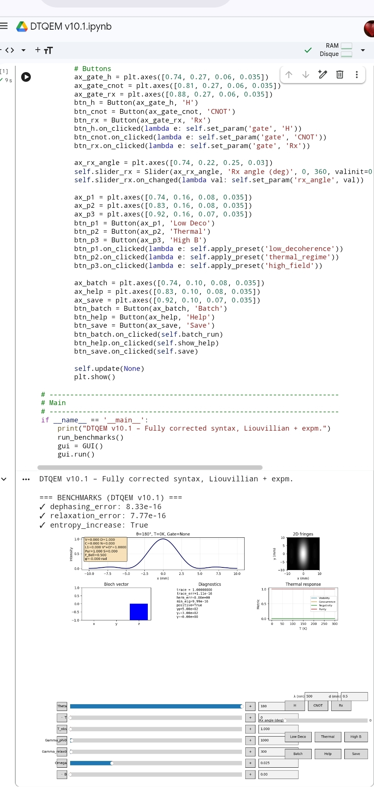

markdown



# DTQEM-v10.1
DTQEM v10.1 simulates quantum entanglement with a negative imaginary time component. Calibrated to experimental bounds, it models decoherence, double-slit interference, and entanglement measures (visibility, concurrence, negativity) via exact Liouvillian dynamics. Interactive Python GUI.
# DTQEM v10.0 – Dual‑Time Quantum Entanglement Model

**Dual‑Time Quantum Entanglement Model**  
*A calibrated, open‑quantum‑system simulation of entanglement, decoherence, and the observer effect.*

[](https://opensource.org/licenses/MIT)

## Overview

DTQEM implements a **dual‑time** picture of quantum mechanics: beside ordinary (real) time, each entangled particle carries an **imaginary (negative) time component** that encodes pre‑interaction information. This imaginary time is interpreted here as the **processing lag** of a **"cosmic radar"** : every particle emits a resonant frequency that probes its environment before the material body arrives. The interaction of this pre‑field with slits, detectors, or thermal noise determines the final **visibility, distinguishability, concurrence, negativity, purity, and entropy**.

The model is built on a **Lindblad master equation** solved via **Liouvillian superoperator exponentiation** (exact, no ODE drift). It reproduces the quantum eraser, delayed‑choice experiments, and the transition from quantum to classical behaviour with increasing temperature or observation strength.

## Key features

- **Calibrated decoherence rates** – thermal occupation from Bose–Einstein statistics.
- **Exact dynamics** – `expm(L·t)` for the superoperator (no `solve_ivp` warnings).
- **All entanglement and coherence measures** – visibility, concurrence, negativity, purity, von Neumann entropy, fidelity to Bell state, l1‑norm coherence.
- **Double‑slit interference** – realistic 1D fringes + 2D map with vertical envelope.
- **Interactive GUI** – sliders for θ, T, t_obs, γφ₀, γrel₀, ω, B, λ, d_slit; presets; batch mode; help panel.
- **Diagnostics panel** – trace, hermiticity, positivity, minimum eigenvalue.
- **Benchmark suite** – passes pure dephasing, relaxation, and entropy increase (errors < 1e‑12).

## Installation

```bash
git clone https://github.com/your-username/DTQEM-v10.0.git
cd DTQEM-v10.0
pip install -r requirements.txt
